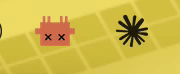

<!-- Before publishing: (1) replace <your-username> with your GitHub handle,
     (2) record assets/demo.gif via ./demo.sh (see "Recording the demo GIF"). -->

<h1 align="center">🤖 ClaudeMood</h1>

<p align="center">
  <b>See what Claude Code is doing — without alt-tabbing to the terminal.</b><br/>
  A little Claude lives in your macOS menu bar and reacts as it works, waits, and finishes.
</p>

<p align="center">
  
  
  /claude-mood?style=social" alt="stars">
</p>

<p align="center">
  <!-- Record this with ./demo.sh + Kap — see "Recording the demo GIF" below -->
  
</p>

## Why

I kept alt-tabbing to my terminal just to check whether Claude Code was still
working or waiting on me. So I put its status in my menu bar — one glance, no
context switch. An animated Claude shows the state, and a soft chime nudges you
the moment it needs you.

## States

| | State | What it means |
|---|---|---|
| 🟡 | **Working** | Claude is thinking / running tools |
| 🔴 | **Needs you** | Waiting for a permission or your input — *plays a chime* |
| 🟢 | **Done** | Finished the turn — *plays a chime* |
| ⚪️ | **Idle** | Nothing running |

## Install

```bash
git clone https://github.com/<your-username>/claude-mood ~/claude-mood
cd ~/claude-mood && ./install.sh
```

That's it — the Claude appears in your menu bar and **starts on every login**.
Quit anytime from the menu (**Quit Claude Status**); remove with `./uninstall.sh`.

<sub>`install.sh` is transparent: it creates a self-contained `venv` (so it never
touches your global Python), **appends** its hooks to `~/.claude/settings.json`
(never overwrites your existing hooks), and installs a LaunchAgent for autostart.</sub>

## How it works

```
Claude Code hooks ──▶ ~/.claude/cc-status.json ──▶ menu-bar app polls & animates
 (UserPromptSubmit/PreToolUse → working, Notification → needs-you,
  Stop → done, SessionEnd → idle)
```

A ~120-line menu-bar app ([`menubar.py`](menubar.py)) polls a small state file
that the hooks write. No daemon framework, no magic.

## Privacy & Security

- **No network calls.** It only reads/writes local files under `~/.claude/`.
- **No telemetry, no API keys, no `--dangerously-skip-permissions`.**
- The hook is a tiny shell script ([`hook.sh`](hook.sh)) that writes one line of
  JSON and plays a local sound. Read every line yourself — it's all here.

## Customize

Drop your own art/sounds into `assets/` — any GIF/PNG and any `.mp3` works:

| File | Shown when |
|---|---|
| `assets/claude-fu.gif` | working |
| `assets/claude-loading.gif` | needs you |
| `assets/claude-sparkle.gif` | done |
| `assets/claude-fail.png` | idle |
| `assets/confirm.mp3` / `assets/done.mp3` | sounds |

Per-state size/alignment is auto-handled (artwork is cropped to its content and
centered), so any image just works.

## Requirements

macOS · `python3` (the installer builds its own venv for `Pillow` + `pyobjc`).

## Recording the demo GIF

```bash
./demo.sh        # cycles working → needs-you → done → idle with pauses
```
1. Install [Kap](https://getkap.co) (free, no watermark).
2. Start a Kap recording over the **menu-bar area** (top-right).
3. Run `./demo.sh` and let it cycle (~20s).
4. Crop tight to the icon, export as GIF (<5 MB), save as `assets/demo.gif`.

## Credits

Emoji are community artwork from [EmojiBox](https://www.emojibox.app/topics/claude);
notification chimes are Claude's own UI sounds. For personal use.

## License

[MIT](LICENSE)
